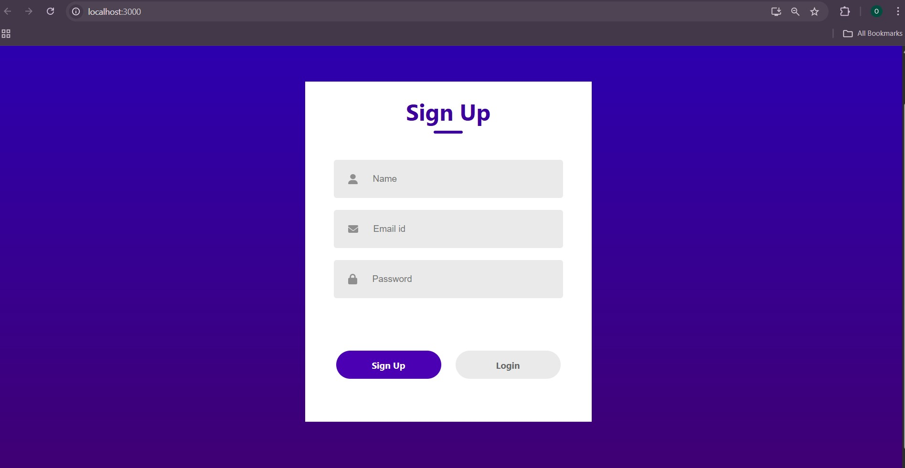
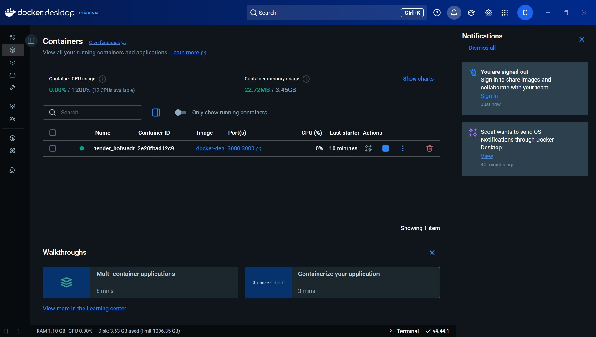
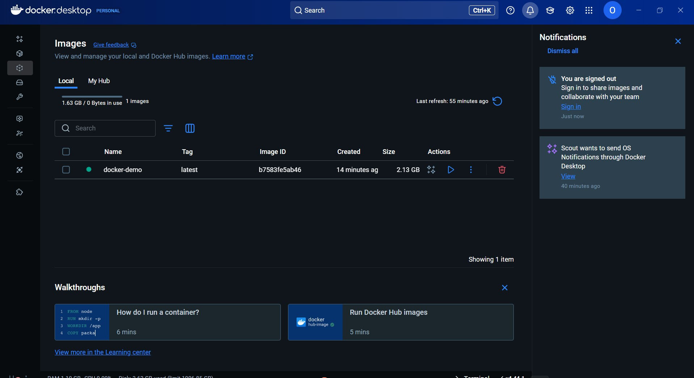
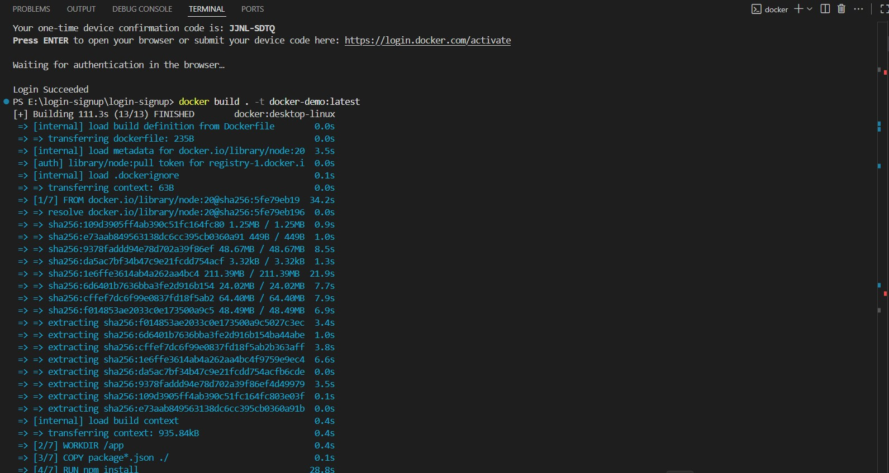
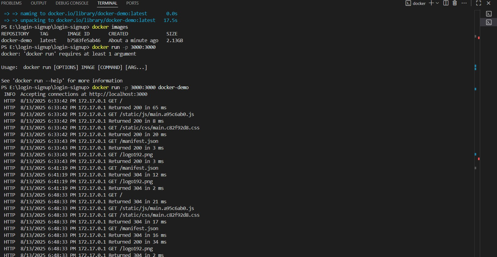

# Dockerized React Static Login Page (Development Mode)

A Dockerized **React static login page** built with **Create React App** and configured for development mode using Node.js inside a container. This setup ensures a consistent development environment, enables **hot reloading**, and streamlines local testing.

---

## 🚀 Features
- **Dockerized** for consistent setup across machines
- **Hot Reloading** for instant UI updates during development
- Built with **Create React App**
- Runs inside a **Node.js** container
- Simple, clean static **login page UI**

---

## 🛠️ Prerequisites
- [Docker](https://www.docker.com/get-started) installed on your system

---

## Screenshots

 ### Login Signup page
  
 ### Container
  

  ### Image
   

   

   

  
    


---
## 🐳 Running the App with Docker

### 1️⃣ Build the Docker image
```bash
docker build . -t docker-demo:latest
docker run -p 3000:3000 docker-demo
# Open in browser:
http://localhost:3000


